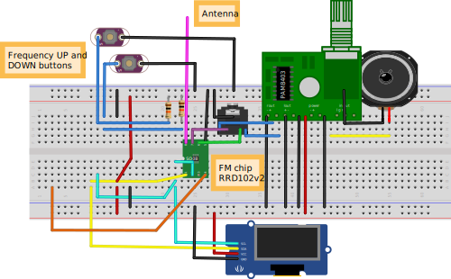

# FM Radio on RDA5807 chip

This project is a FM Radio receiver based on RDA5807 chip (RRD 102v2), Arduino Nano and OLED display.

# Receiver features
- Receive FM Radio band 87..108MHz
- Find next and previous FM station on buttons pressed
- Headphones or speaker output
- Display current FM frequency
- Save selected FM station frequency to EEPROM
- Show splash screen on start

# Hardware
## Hardware parts list

|# | Part name                     | Amount
|--|-------------------------------|-------|
|1.|Arduino Nano                   |    1  |
|2.|RRD-102v2 FM chip              |    1  |
|3.|Pushbutton                     |    2  |
|4.|Pullup resistor 10 kOhm        |    2  |
|5.|GF1002 class-D audio amplifier |    1  |
|6.|0.96in 128x64 OLED display     |    1  |
|7.|3.5mm audio jack male          |    1  |
----

## Hardware design

RRD102v2 is the component required for receiving FM radio. RRD102v2 based on RDA5807 chip. Its have VCC voltage is 3.3V, direct output left and right sound channels on headphones and supports I2C control interface.

When input voltage started Arduino Nano intialize RDA5807 FM chip and set receive frequency value from EEPROM. Default FM frequency is 104.7MHz and can be changed via firmware source code. OLED display shows current receive frequency.

On FREQ_UP or FREQ_DOWN buttons pushed Arduino Nano send to RRD102v2 command to searching for next/previous FM station. When searching in the direction of increasing the receceive frequency, having reached the upper limit of the FM range, the search procedure continues from the lower limit. Similarly, upon reaching the lower limit.

Long press of FREQ_DOWN button saves current FM frequency to Arduino Nano EEPROM.

Sound volume on headphones output is not regulated yet.

GF1002 is D-class amplifier to output sound to the speaker. Its have left and right channels, but now used only one channel.

# Firmware

# IDE and programming language
Firmware was developed using 
 and C++ programming language for Arduino.

# List of libraries

